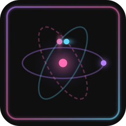

<p align="center">
  
</p>

<h1 align="center">SubFrame</h1>

<p align="center">
  Terminal-centric IDE for AI-assisted development
  <br />
  <em>Enhances your AI coding tools — never replaces them</em>
</p>

<p align="center">
  <a href="https://github.com/Codename-11/SubFrame/actions/workflows/ci.yml"></a>
  
  <a href="https://github.com/Codename-11/SubFrame/releases"></a>
  
</p>

<p align="center">
  
  
  
  
  
  
</p>

<p align="center">
  <a href="#installation">Install</a> · <a href="#features">Features</a> · <a href="#development">Development</a> · <a href="https://sub-frame.dev">Website</a> · <a href="https://sub-frame.dev/guide/">Docs</a>
</p>

---

> **This project is under active development and in public beta.** We're looking for early adopters to test, break things, and help shape the direction of SubFrame. If you run into issues or have ideas, [open an issue](https://github.com/Codename-11/SubFrame/issues) — every report helps.

https://github.com/user-attachments/assets/75837799-2a38-42ff-917b-885946c27184

A lightweight desktop IDE for [Claude Code](https://claude.com/claude-code), [Codex CLI](https://github.com/openai/codex), and [Gemini CLI](https://github.com/google-gemini/gemini-cli). SubFrame wraps your existing AI tools in a structured workspace — persistent context, task tracking, codebase mapping, and a multi-terminal environment — so nothing gets lost between sessions.

> **Platform support:** Currently tested and released for **Windows**. macOS and Linux builds are generated but **untested** — community testing and feedback welcome. See [Installation](#installation) for platform-specific prerequisites.

> SubFrame builds upon [Frame](https://github.com/kaanozhan/Frame) by [@kaanozhan](https://github.com/kaanozhan), extended with React 19, TypeScript, and a modernized architecture.

## Why SubFrame?

As AI-assisted projects grow, context gets lost between sessions. Decisions are forgotten, tasks slip through the cracks, and you re-explain the same things over and over.

SubFrame solves this with a **standardized project layer** that your AI tools read automatically at session start — tasks, codebase structure, session notes, and architecture decisions all carry forward. A single **Initialize Workspace** command sets up everything your AI tools need, so every session starts with full context instead of a blank slate.

The core principle: **augment, don't replace.** Claude Code, Gemini CLI, and Codex CLI work exactly as they normally would. SubFrame layers structure on top — persistent context, task management, and a unified workspace — making each tool more effective without changing how any of them behaves.

## Features

### Initialize Workspace

The entry point to SubFrame. Run `subframe init` from the CLI or click the **Initialize** button in the GUI. One command creates a standardized project layer that AI tools pick up automatically:

```
.subframe/
  config.json               # Project configuration
  STRUCTURE.json             # Codebase module map (auto-updates on commit)
  PROJECT_NOTES.md           # Session notes and decisions
  tasks.json                 # Sub-Task index (auto-generated)
  tasks/                     # Individual task markdown files
  QUICKSTART.md              # Getting started guide
  docs-internal/             # ADRs, architecture, changelog, IPC reference
  bin/codex                  # Codex CLI wrapper script
AGENTS.md                    # AI instructions (tool-agnostic)
CLAUDE.md                    # Backlink to AGENTS.md (Claude Code reads natively)
GEMINI.md                    # Backlink to AGENTS.md (Gemini CLI reads natively)
.githooks/pre-commit         # Auto-updates STRUCTURE.json on commit
.claude/
  settings.json              # Hook wiring configuration
  skills/                    # Slash command skills
```

Existing user content in CLAUDE.md and GEMINI.md is preserved — SubFrame only adds a small backlink reference.

### Hooks and Automation

SubFrame installs hooks that automate context awareness throughout your workflow:

- **SessionStart** — Injects pending/in-progress sub-tasks into context at startup, resume, and after compaction
- **UserPromptSubmit** — Fuzzy-matches user prompts against pending sub-task titles and suggests starting them
- **Stop** — Reminds about in-progress sub-tasks when Claude finishes responding
- **PreToolUse / PostToolUse** — Monitor agent tool usage for the Agent Timeline
- **Git pre-commit** — Auto-updates STRUCTURE.json before each commit

### Skills (Slash Commands)

SubFrame installs Claude Code skills as slash commands:

| Command | Description |
|---------|-------------|
| `/sub-tasks` | View and manage sub-tasks (list, start, complete, add, archive) |
| `/sub-audit` | Run code review and documentation audit on recent changes |
| `/sub-docs` | Sync all SubFrame documentation after feature work |
| `/sub-ipc` | Regenerate IPC channel reference documentation |
| `/release` | Version bump, changelog, release notes, commit, and tag |

### Sub-Task System

Markdown-based task tracking stored in `.subframe/tasks/` with YAML frontmatter. Each task captures the original user request, acceptance criteria, and session context.

- **CLI management** — `node scripts/task.js list|start|complete|add|update|archive`
- **Visual task panel** — Table view with status filters, priority sorting, inline expand
- **Multiple views** — Table, timeline, dependency graph, and kanban board
- **Lifecycle** — `pending` → `in_progress` → `completed`
- **Auto-detected** — Hooks recognize task-like requests from conversation and suggest creating them

### IDE Workspace

- **3-Panel Layout** — File explorer, multi-terminal center, contextual side panels
- **Multi-Terminal** — Up to 9 terminals with tabs or grid view (2x1 through 3x3), resizable cells
- **File Editor** — CodeMirror 6 overlay with syntax highlighting for 15+ languages
- **Real PTY** — Full pseudo-terminal via node-pty, not subprocess pipes
- **File Previews** — Inline preview for Markdown, HTML, and images

### Context Preservation

Every session starts informed instead of cold:

- **PROJECT_NOTES.md** — Captures architecture decisions, technology choices, and approach changes as they happen
- **STRUCTURE.json** — Maps modules, exports, dependencies, and function locations across the codebase
- **tasks.json** — Tracks work with original user requests and acceptance criteria preserved
- **Auto-loaded** — AI reads all three at the start of each session, surviving context compaction

### Health and Audit Panel

Per-component health status for the entire SubFrame installation, grouped by category (Core, Hooks, Skills, Claude Integration, Git):

- **Status badges** — Healthy, Outdated, or Missing for each component
- **One-click updates** — "Update All" to fix outdated components, or update individually
- **Granular uninstall** — Checkboxes to selectively remove hooks, skills, backlinks, AGENTS.md, or the .subframe/ directory
- **Dry run preview** — See what would change before committing to an uninstall

### Agent Activity Monitor

Real-time visibility into Claude Code agent sessions:

- **Session status** — Active, busy, idle, or completed with live status badges
- **Tool tracking** — Displays the current tool being used and total step count
- **Timeline view** — Chronological view of all agent steps with tool usage details
- **Session list** — Browse and review past agent sessions in full-view mode

### AI Tool Integration

- **Multi-Tool Support** — Switch between Claude Code, Codex CLI, and Gemini CLI from the toolbar
- **Native Context Injection** — Claude reads CLAUDE.md, Gemini reads GEMINI.md, Codex uses a wrapper script that injects AGENTS.md
- **Sessions Panel** — Browse past Claude Code sessions with conversation history
- **Usage Tracking** — Monitor Claude Code session counts and weekly usage statistics
- **AI Files Panel** — View and manage context files (AGENTS.md, CLAUDE.md, GEMINI.md) from the UI

### Git and GitHub

- **Branch Management** — View, switch, create, and delete branches
- **GitHub Issues** — Browse repository issues directly from the sidebar

### Other

- **Overview Dashboard** — Project metrics, module counts, task summaries, health status, and recent file activity at a glance
- **Plugin System** — Extend SubFrame with plugins
- **Structure Map** — Interactive D3.js force-directed graph of module dependencies, color-coded by process layer
- **Theme System** — 4 built-in presets (Classic Amber, Synthwave Traces, Midnight Purple, Terminal Green) with custom theme support, color pickers, and feature toggles (neon traces, scanlines, logo glow)
- **Settings Panel** — Configure appearance, terminal, editor, AI tools, and updater preferences
- **Keyboard Shortcuts** — Full keyboard navigation:

| Shortcut | Action |
|----------|--------|
| `Ctrl+B` | Toggle sidebar |
| `Ctrl+Shift+T` | New terminal |
| `Ctrl+Shift+W` | Close terminal |
| `Ctrl+1-9` | Jump to terminal |
| `Ctrl+Shift+G` | Toggle grid view |
| `Ctrl+Shift+S` | Sub-Tasks panel |
| `Ctrl+Shift+A` | Agent Activity panel |
| `Ctrl+,` | Settings |
| `Ctrl+?` | Show all shortcuts |

### SubFrame Project System

Initializing a workspace creates a standard set of files your AI tools read automatically:

| File | Purpose |
|------|---------|
| `AGENTS.md` | AI-agnostic instructions — native tool files (CLAUDE.md, GEMINI.md) backlink here |
| `.subframe/STRUCTURE.json` | Machine-readable module map (exports, dependencies, function locations) |
| `.subframe/tasks/` | Individual task markdown files with YAML frontmatter |
| `.subframe/tasks.json` | Auto-generated task index for backward-compatible access |
| `.subframe/PROJECT_NOTES.md` | Session notes and decisions preserved verbatim |
| `.subframe/config.json` | Project-level configuration |
| `.subframe/docs-internal/` | ADRs, architecture overview, changelog, IPC channel reference |
| `.subframe/QUICKSTART.md` | Getting started guide |
| `.claude/settings.json` | Hook wiring configuration |
| `.claude/skills/` | Slash command skills (sub-tasks, sub-audit, sub-docs, sub-ipc, release) |
| `.githooks/pre-commit` | Auto-updates STRUCTURE.json before each commit |

## Tech Stack

| Component | Technology |
|-----------|-----------|
| Framework | Electron 28 |
| Renderer | React 19 · TypeScript (strict) |
| State | Zustand · TanStack Query |
| UI | shadcn/ui · Tailwind CSS v4 |
| Animations | Framer Motion |
| Editor | CodeMirror 6 |
| Terminal | xterm.js 5.3 |
| PTY | node-pty 1.0 |
| Bundler | esbuild |

## Installation

> **Note:** Pre-built releases are currently available for **Windows** only. macOS and Linux builds are produced by CI but have not been tested — if you try them, please [report any issues](https://github.com/Codename-11/SubFrame/issues).

### Prerequisites
- **Node.js 18+** and npm
- **Python** + **C++ Build Tools** (for `node-pty` native compilation):
  - **Windows** — VS 2022 Build Tools with "Desktop development with C++"
  - **macOS** — `xcode-select --install`
  - **Linux** — `sudo apt install build-essential`

### Quick Start

```bash
git clone https://github.com/Codename-11/SubFrame.git
cd SubFrame
npm install
npm run dev     # Watch mode + Electron
```

> **Windows**: Run `DEV_SETUP.bat` for automated prerequisite installation.

### Installing AI Tools

```bash
npm install -g @anthropic-ai/claude-code   # Claude Code
```

See [Codex CLI](https://github.com/openai/codex) and [Gemini CLI](https://github.com/google-gemini/gemini-cli) for their respective install instructions.

## Development

### Commands

```bash
npm run dev          # Watch mode (main TS + React) + Electron
npm run build        # Build main TS + React renderer
npm run typecheck    # TypeScript strict-mode check (main + renderer)
npm test             # Vitest test suite
npm run lint         # ESLint (TS/TSX)
npm run check        # typecheck + lint + test (all quality gates)
npm run structure    # Update .subframe/STRUCTURE.json
```

### Architecture

Electron app with two processes communicating over typed IPC channels (`src/shared/ipcChannels.ts`):

| Layer | Path | Stack |
|-------|------|-------|
| **Main** | `src/main/*.ts` | Node.js · TypeScript · Manager modules (`init()` + `setupIPC()`) |
| **Renderer** | `src/renderer/` | React 19 · TSX · Zustand stores · TanStack Query hooks · shadcn/ui |
| **Shared** | `src/shared/*.ts` | Typed IPC channels · Constants · Templates |

Detailed architecture docs live in `.subframe/docs-internal/`.

### Production Builds

```bash
npm run dist          # Current platform (unpacked)
npm run dist:win      # Windows installer (NSIS)
npm run dist:mac      # macOS (signed DMG)
```

## Contributing

SubFrame is in early beta and we'd love your help. Whether it's bug reports, feature ideas, documentation improvements, or code contributions — everything is welcome.

**Ways to get involved:**

- **Try it out** — Download, use it with your AI tools, and [report what breaks](https://github.com/Codename-11/SubFrame/issues/new)
- **Request features** — Have an idea? [Open an issue](https://github.com/Codename-11/SubFrame/issues/new) and describe your use case
- **Submit a PR** — Bug fixes, improvements, and new features are all appreciated
- **Spread the word** — Star the repo, share it with other developers

**To contribute code:**

1. Fork the repo
2. Create a feature branch (`git checkout -b feature/your-feature`)
3. Commit using [Conventional Commits](https://www.conventionalcommits.org/) (`feat:`, `fix:`, `docs:`, etc.)
4. Open a Pull Request

We review all PRs and aim to respond promptly. Don't worry about getting everything perfect — we'd rather see your contribution and iterate together.

## License

Business Source License 1.1 — see [LICENSE](./LICENSE)

Source code is available for reading, forking, and contribution. Commercial use that competes with SubFrame requires a separate agreement with Axiom-Labs. Each version converts to Apache-2.0 four years after release.

## Acknowledgments

SubFrame is built upon [Frame](https://github.com/kaanozhan/Frame) by [@kaanozhan](https://github.com/kaanozhan), whose original project provided the foundation — multi-terminal PTY management, file explorer, and the vision for a terminal-centric AI coding IDE.

- Terminal powered by [xterm.js](https://xtermjs.org/) and [node-pty](https://github.com/microsoft/node-pty)
- UI components from [shadcn/ui](https://ui.shadcn.com/)
- Built with [Claude Code](https://claude.com/claude-code)

---

<p align="center">
  <strong>v0.2.7-beta</strong> · Public beta — <a href="https://github.com/Codename-11/SubFrame/issues">feedback welcome</a> · <a href="https://sub-frame.dev">sub-frame.dev</a>
</p>
